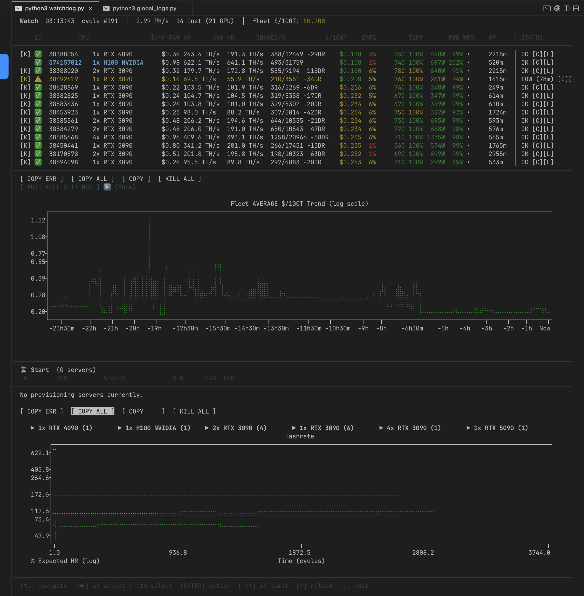
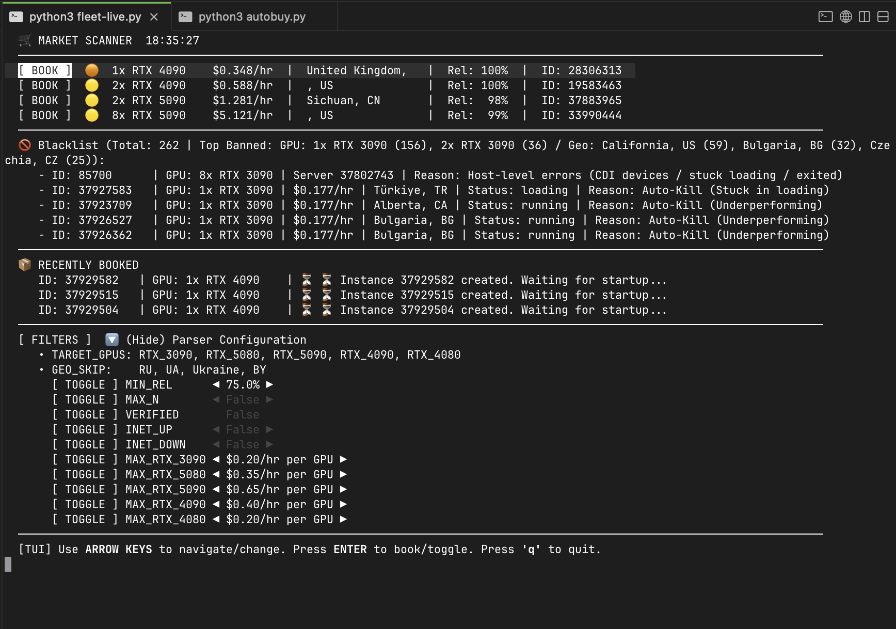
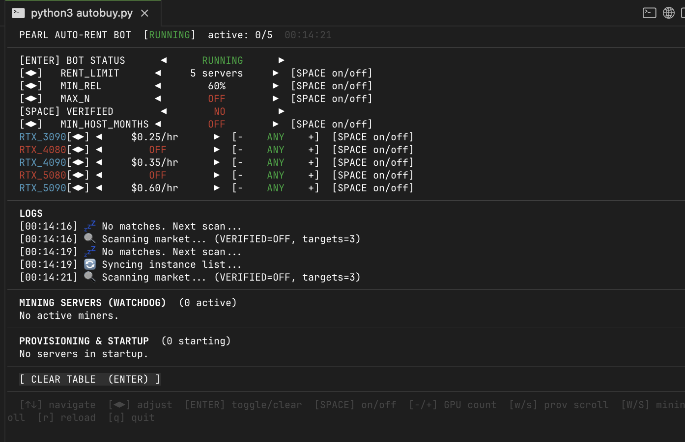

# Pearl Fleet Operations Manager

<p align="center">
  <br>
  
</p>

A comprehensive Python-based automation and monitoring suite designed to deploy, manage, and optimize high-performance GPU instances across cloud providers (Vast.ai, DigitalOcean) for continuous workloads (e.g., hashcat, computational tasks, machine learning). 

The system implements fully autonomous fleet scaling, real-time profitability tracking, and robust recovery mechanisms with minimal manual intervention.

## Core Features

- **Fleet Watchdog (`core/watchdog.py`)**: Real-time hashrate and efficiency monitor. Tracks performance metrics dynamically, identifies failing GPUs, and automatically terminates instances falling below the defined profitability threshold.
- **Autonomous Provisioning (`core/autobuy.py`)**: Programmatic GPU procurement bot. Scans the Vast.ai marketplace to automatically identify and rent instances that meet specific price/performance criteria (e.g., $/100TH margins).
- **DigitalOcean Integration (`digitalocean/do_gpu_sniper.py`)**: Dedicated droplet provisioner bypassing web UI bottlenecks to spin up H100/A100 instances globally based on immediate API availability.
- **TUI Dashboard (`core/fleet-live.py`)**: Terminal User Interface built with custom rendering logic to display live metrics, total fleet cost, combined computational power, and active server counts in a unified view.
- **Telegram Reporting (`scripts/tg_price_bot.py`)**: Automated market and operations tracking pushing updates directly to designated Telegram channels.

## Interface Showcase

<p align="center">
  <br>
  
</p>
<br>
<p align="center">
  <br>
  
</p>

## Project Architecture

```text
pearl/
├── core/                   # Main business logic (Auto-rent, Watchdog, TUI)
├── digitalocean/           # DigitalOcean specific API integration and snipers
├── scripts/                # Helper tools and Telegram reporting bots
├── web/                    # (Optional) Flask web interface for fleet overview
├── data/                   # JSON data stores (blacklists, states, logs)
└── update_manual.sh        # Deployment utility scripts
```

## Setup & Installation

### Requirements
- Python 3.10+
- Vast.ai CLI (`vastai`)
- SSH Key configured for server access

### Quick Start

1. **Clone the repository:**
   ```bash
   git clone https://github.com/your-username/pearl-fleet.git
   cd pearl-fleet
   ```

2. **Set up the virtual environment:**
   ```bash
   python3 -m venv .venv
   source .venv/bin/activate
   pip install -r requirements.txt # Or install dependencies manually (requests, plotext, python-dotenv)
   ```

3. **Configure Environment Variables:**
   Copy the example config and add your private API keys.
   ```bash
   cp .env.example .env
   # Edit .env with your DigitalOcean Token, Telegram Bot Token, and Wallets
   ```

4. **Run the Watchdog (TUI mode):**
   ```bash
   python3 core/fleet-live.py
   ```

## Security & Best Practices
- **API Keys:** Never hardcode API keys or Wallet Addresses. Always utilize the `.env` file implementation.
- **SSH Access:** Ensure your `~/.ssh/vast_key` is correctly configured and has strict permissions (`chmod 600`).
- **Rate Limits:** The bot implements "Ghost Cooldown" periods (e.g., in DigitalOcean snipers) to respect provider API rate limits (5,000 requests/hour limit).

## Disclaimer
This project was built for specialized computational orchestration. Please ensure compliance with the Terms of Service of your chosen cloud providers (DigitalOcean, Vast.ai) when deploying automated provisioning scripts.
